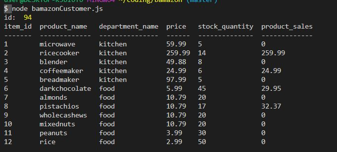
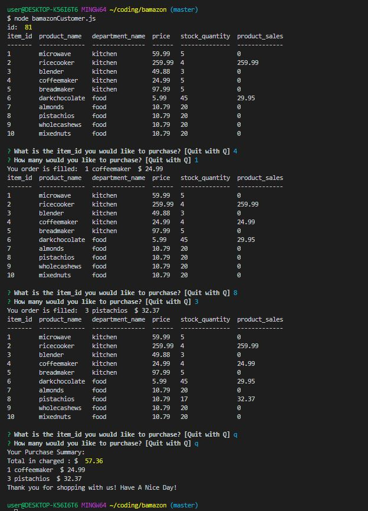
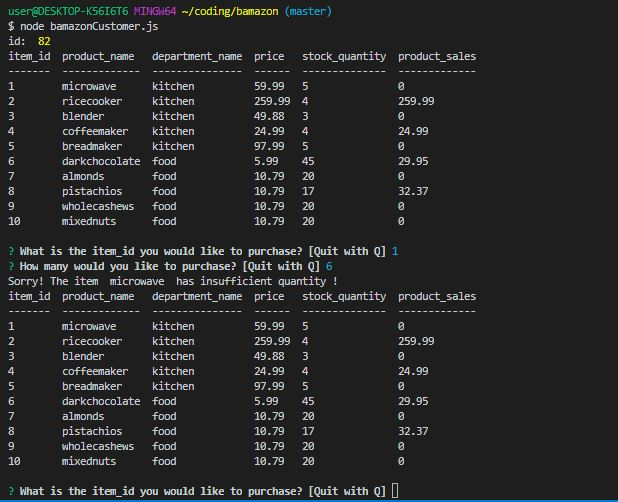
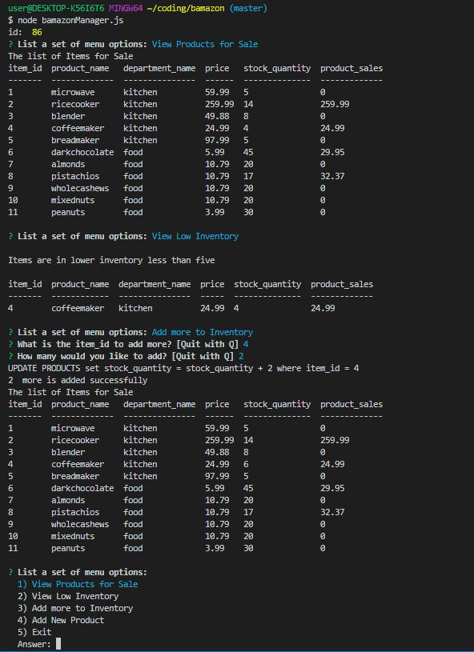
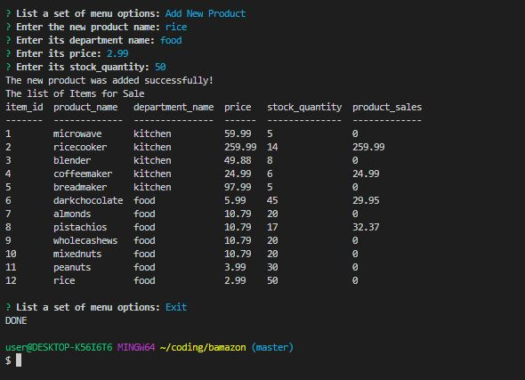
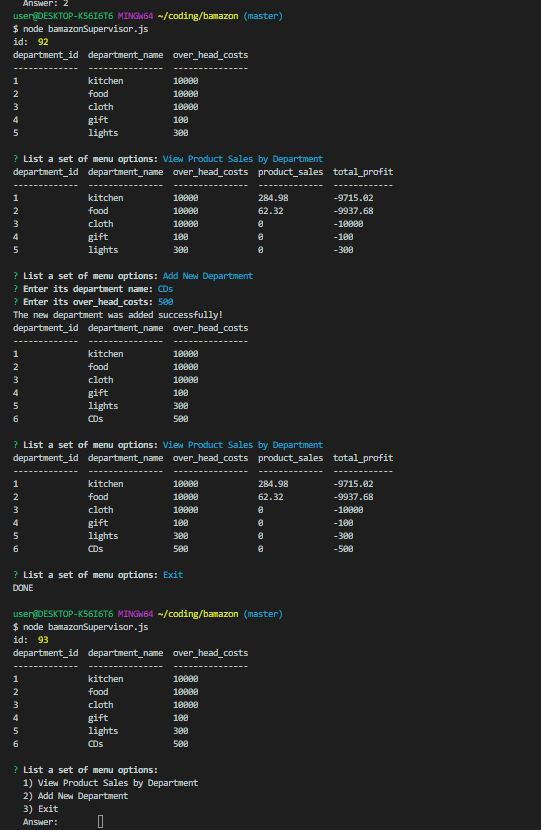

# bamazon
bamazon
*   https://github.com/yzhouyzhou/bamazon
*   https://yzhouyzhou.github.io/bamazon
*   The link was also added into my updated portfolio https://yzhouyzhou.github.io/Bootstrap-Portfolio/games.html
    bamazon July 18 2019

*   bamazon application is an Amazon-like store. A list items are in the store for sales. mySQL is use to store data. A table called products contain columns: item_id, product_name, department_name, price, stock_quantity and product_sales

*   Customer View : user gets prompt with two messages
    *   the first ask them the ID of the product they would like to buy
    *   the second message ask how many units of the product they buy
    
    *   in case user inputs the items insufficent_quantity message
    

*   Manager View: a list of menu options allow to mainteance the store
    *   view product for sale
    *   view low inventory less than 5
    *   add more to inventory
    
    *   add new product
    *   exit
    

*   Supervisor View: add a new table called departments which contain columns: department_id, department_name and over_head_costs
    *   view product sales by department: join departments and products tables to get results
    *   Add new department
    *   Exit
    
